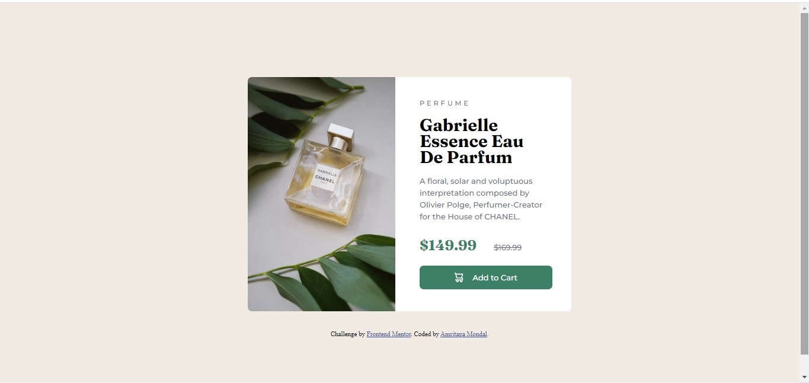

# Frontend Mentor - Product preview card component solution

This is a solution to the [Product preview card component challenge on Frontend Mentor](https://www.frontendmentor.io/challenges/product-preview-card-component-GO7UmttRfa). Frontend Mentor challenges help you improve your coding skills by building realistic projects. 

## Table of contents

- [Overview](#overview)
  - [The challenge](#the-challenge)
  - [Screenshot](#screenshot)
  - [Links](#links)
- [My process](#my-process)
  - [Built with](#built-with)
  - [What I learned](#what-i-learned)
  - [Useful resources](#useful-resources)
- [Author](#author)
- [Feedback](#feedback)

## Overview

### The challenge

Users should be able to:

- View the optimal layout depending on their device's screen size
- See hover and focus states for interactive elements

### Screenshot

### Links

- Solution URL: [Add solution URL here](https://github.com/MondalAmrit/Product-preview-card-component)
- Live Site URL: [Add live site URL here](https://mondalamrit.github.io/Product-preview-card-component/)

## My process

- Mobile-first approach : I first built the project according to what I thought it would look like in a mobile.
- Used flexbox for responsiveness wherever rquired.
- After I finished the mobile view, I then put media queries for larger screens.

### Built with

- Semantic HTML5 markup
- CSS custom properties
- Flexbox
- Mobile-first workflow

### What I learned

- Responsiveness
- Different images in mobile-view and desktop-view

### Useful resources

- [Google Fonts](https://fonts.google.com/) - There are many awesome fonts here along with different styles. It has the feature of testing/previewing your text to help you decide on your font family/style.

## Author

- Frontend Mentor - [@MondalAmrit](https://www.frontendmentor.io/profile/MondalAmrit)
- LinkedIn - [@Amritapa Mondal](https://www.linkedin.com/in/amritapa-mondal-065936229/)

## Feedback

- Any and every feedback is appreciated.